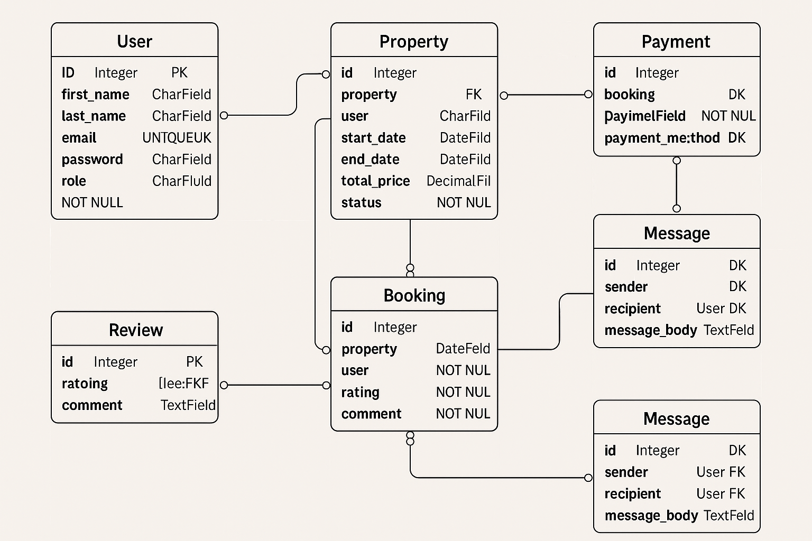

# Entity-Relationship Diagram Specification

## 📌 Entities & Attributes

### 🧑 User
- `user_id` (Primary Key)
- `first_name`
- `last_name`
- `email`
- `password_hash`
- `phone_number`
- `role`
- `created_at`

### 🏡 Property
- `property_id` (Primary Key)
- `host_id` (Foreign Key → User.user_id)
- `name`
- `description`
- `location`
- `pricepernight`
- `created_at`
- `updated_at`

### 📅 Booking
- `booking_id` (Primary Key)
- `property_id` (Foreign Key → Property.property_id)
- `user_id` (Foreign Key → User.user_id)
- `start_date`
- `end_date`
- `total_price`
- `status`
- `created_at`

### 💳 Payment
- `payment_id` (Primary Key)
- `booking_id` (Foreign Key → Booking.booking_id)
- `amount`
- `payment_date`
- `payment_method`

### 🌟 Review
- `review_id` (Primary Key)
- `property_id` (Foreign Key → Property.property_id)
- `user_id` (Foreign Key → User.user_id)
- `rating`
- `comment`
- `created_at`

### 💬 Message
- `message_id` (Primary Key)
- `sender_id` (Foreign Key → User.user_id)
- `recipient_id` (Foreign Key → User.user_id)
- `message_body`
- `sent_at`

---

## 📌 Relationships

- **A User can own multiple Properties**
  - One-to-Many (User → Property)

- **A User can make multiple Bookings**
  - One-to-Many (User → Booking)

- **A Booking is linked to one Property and one User**
  - Many-to-One (Booking → Property)
  - Many-to-One (Booking → User)

- **A Booking can have one Payment**
  - One-to-One (Booking → Payment)

- **A User can leave multiple Reviews on Properties**
  - One-to-Many (User → Review)
  - Many-to-One (Review → Property)

- **A User can send Messages to other Users**
  - One-to-Many (User → Message) via sender_id
  - One-to-Many (User → Message) via recipient_id

---

## 🎨 Diagram

